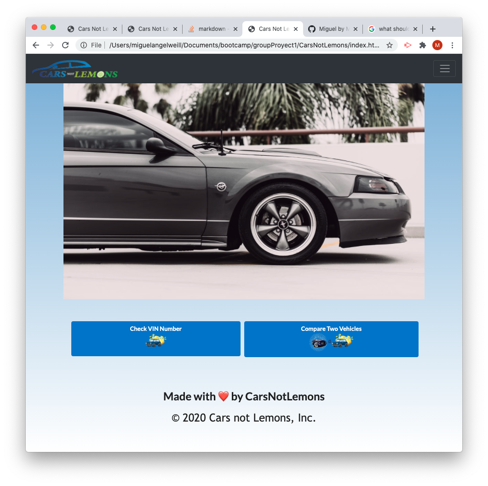

# Cars Not Lemos
* Cars Not Lemons is a website that allows users to check a vehicle by vin nubmer or to compare two vehicles by their vin number. After entering their input which is required we will display to the user long term variables that should be known about a vehicle before you purchase it (All of this depends on the user's financial preference),such as Fuel cost, Maintenance cost, Insurance cost, the sum of these values will give us a total sum of how much the car will cost you. We at Cars Not Lemons do that work for you and give you this total making the user's life easier and educating him on a proper vehicle purchase that meets his financial ability.

* Table of content:
- This website is created for those who are thinking about purchasing a vehicle but are not aware of the long term expenses.
- This website uses third party API's to pull the information about the vehicles, and another third party API for the gif images that qualify the car as a "lemon" or a "car to buy". The API for the vehicle information is called VinAudit, this API is contected to the goverment data base of vehicles so it can pretty much give you all sort of variables regarding the vehicle that is being compared from a relianble source.
- There is a contact information section where you will be able to see all of the colaborators of the project and send them an email to contact them if you wish to do so.
- If the user enters an incorrect vin number the websites responds with a prompt that tells the user that the vin they chose to check for is an invalid vin number.

* Future Development goals:
- Allow user to check their vehicle by make, model, year as well as trim.
- Highlighing specific outputs (fuel cost, car maintenance, car insurance) that are more expensive then it's comparison.
- When user chooses to check a single vehicle, we will like to add more information about this vehicle.

* Conclusion
- Our team feels that we've created something unique to the the market, as we believe that there may be others that show certain features that we are showing. None really have analyzed and display the pros and cons that we do for the user.
- We educate the user on a approximate cost of being a car owner, so they could prepare financially before making a final decision.
[]
;
* For you to test: here we have two vin number that you can check if you wish to , JTHBA1D27G500426 , 1vwcm7a34fc006570.
